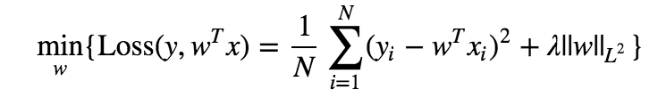
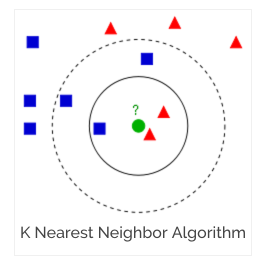

# Used Car Price Predicting Website Application (UCPPWA)
### APMAE4990 Final Proposal 
## Fanchen Zeng (fz2241)    Season Yang ()    Yizhe Gao ()
## Summary 
## Introduction

There has been over 10,000 used cars searched within a 75-mile radius from major cities, including Chicago, Washington, New York, Seattle, etc. It is always a hard problem for the owners to price their used cars given the fact that there is a wide distribution of prices for cars with different conditions. They could guess but this is not an efficient way to maximize money for their cars. 

In this project, we will be using the data to create a web app that could help car owners in New York area price their used cars based on specific car conditions. Specifically, users should be able to enter their used car conditions and the web app should generate the range of price which would most likely to maximize price of their cars.
## Audience

1. Used car owners in New York area who want to price their used car based on specific car conditions. 

2. Used car potential buyers in New York area who want to purchase but do not know which is the optimal used car based on specific conditions of buyers

3. Practitioners who want to analyse the used car saling market
## Component

### 1. Prodicting System

Our used car price predicting team decide to use parametric regression (Linear Ridge Regression) and nonparametric regession (Random Forests Regression) models to prodict the used car price

Ridge Regression:

Random Forests Regression:

### 2. Feedback Learning System

In order to generate data to improve predicting accuracy, our team introduce a feedback learning system in the UCPPWA.

The feedback learning system collects real time data on used car price from the price input of users and from website https://www.cargurus.com/, http://www.autotrader.com/ and so on.

Not only updata the dataset in UCPPWA, our time decide to give reasonable weight to the new data, where the weight can be learned from empirical market research or regression result of existed dataset with time series

<h6 align="center">Fig.1. Weighted Sample</h6> 

### 3. Recommendation System

To better serve the potential buyers who has not decided which one to buy, our team decides to use PCA to reduct the dimension as well as extract features and k-nearest neighbors algorithm to predict where is the optimal range of used cars the potential may tend to purchase. 

<h6 align="center">Fig.2. kNN Algorithm </h6> 

### 4. Visualization Website Application

Inspired by the demonstration of building classification in New York and San Francisco. Our team decides to create a website application to demonstrate our dataset and our systems in UPCCWA

## Interface
## Reference

1. [Ridge Regression](https://github.com/Columbia-Intro-Data-Science/APMAE4990-/blob/master/lectures/Lecture%203%20-%20Model%20Selection%2C%20Evaluation%20and%20Regularization.pdf)

2. [How does random forest works](https://www.quora.com/How-does-randomization-in-a-random-forest-work)

3. [Weighted sample](http://scikit-learn.org/stable/auto_examples/svm/plot_weighted_samples.html)

4. [k-nearest neighbors algorithm](https://en.wikipedia.org/wiki/K-nearest_neighbors_algorithm)

5. [Recommendation System based on kNN](http://stackoverflow.com/questions/7742706/k-nearest-neighbour-vs-user-based-nearest-neighbour)

6. [Visualization Website Application](http://www.r2d3.us/visual-intro-to-machine-learning-part-1/)
